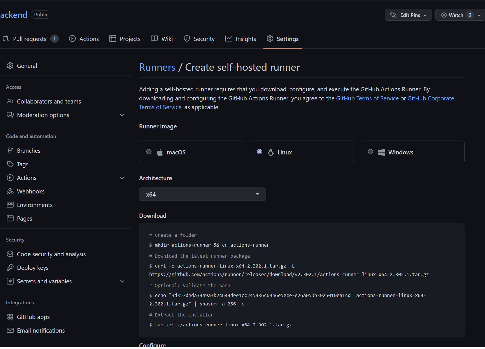
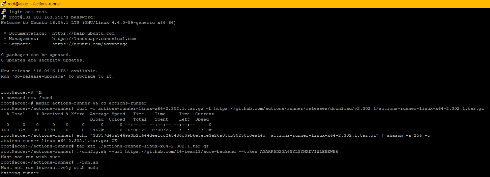
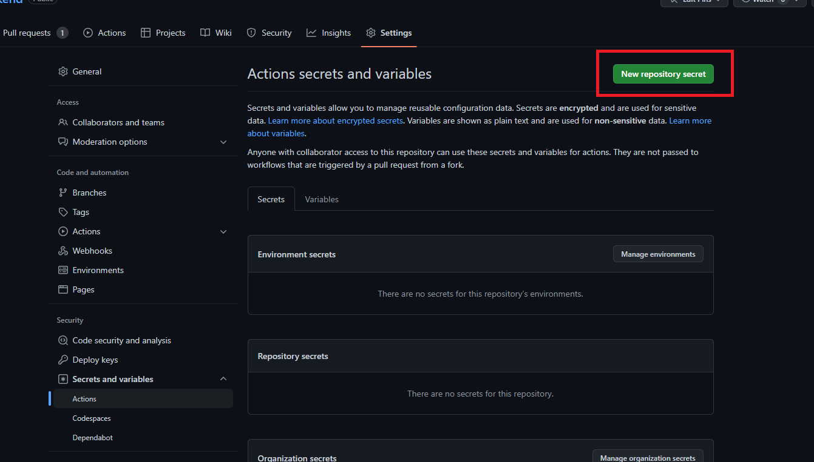
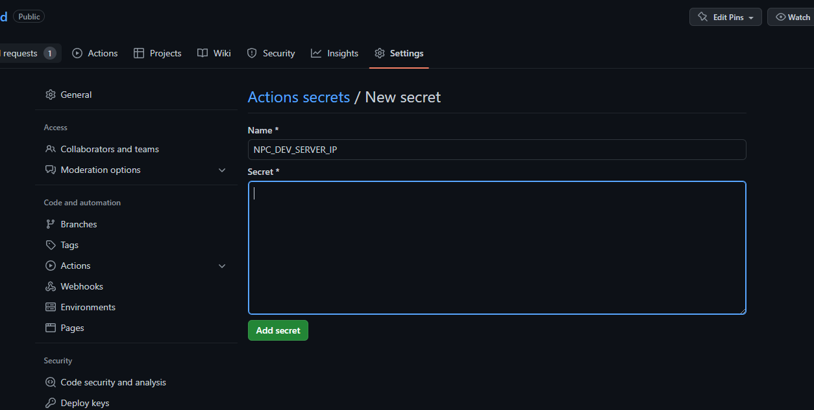
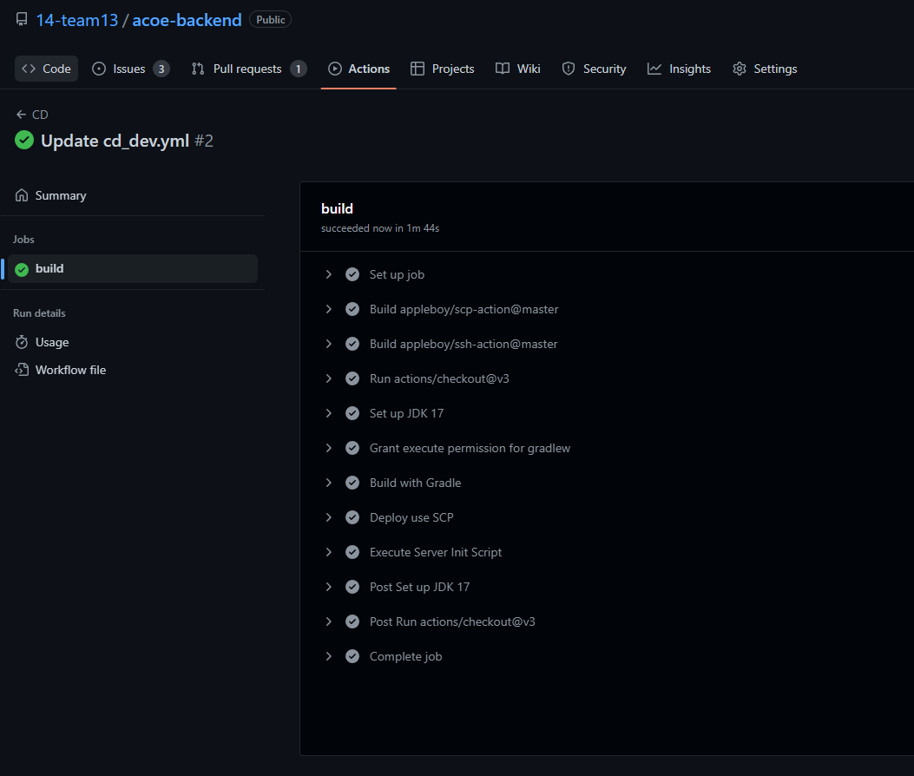
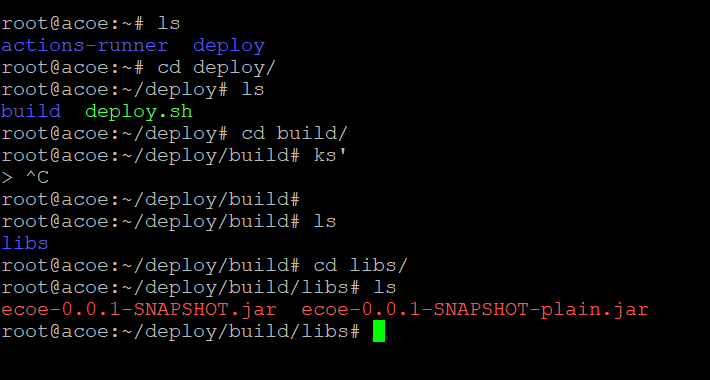

# 🔨 CICD 빌드 파이프라인

### ✔️ step1. 서버에 Github action runner 설치
> 깃헙에서 서버를 조작할 수 있도록 함.  
> https://github.com/14-team13/acoe-backend/settings/actions/runners/new 에서 명령어 제공 
> 
> **ssh로 서버 접속해서 설치, 설정(configuration), 실행**
> 

### ✔️ step2. secret 설정
> 🔑 github action 사용하여 자동 배포할때, 환경변수를 외부 노출없이 저장할 수 있음.  
> **new repository secret 생성 -> 환경변수 저장**
> 
> 

### ✔️ step3. workFlow 설정
> 기본 튜토리얼은 작성해둔 [가이드] 참조(./githubAction_tutorial/CI%20CD(Github%20Action).md)  
> CI와 CD의 스크립트를 나눠서 PR은 CI, PUSH는 CD 스크립트가 트리거될 수 있도록 구성.  
> SCP로 파일 복사 후 디플로이 하는 방식 채용 -> 현재 dev만 적용, 추후 prod 분기처리.  
> SCP, SSH action은 마켓플레이스의 appleboy 사용🙏  
> YAML 스크립트 파일 확인 -> [ci.yml](/.github/workflows/ci_dev.yml)
> / [cd.yml](/.github/workflows/cd_dev.yml)  
> **👍 배포성공**
> 
>  