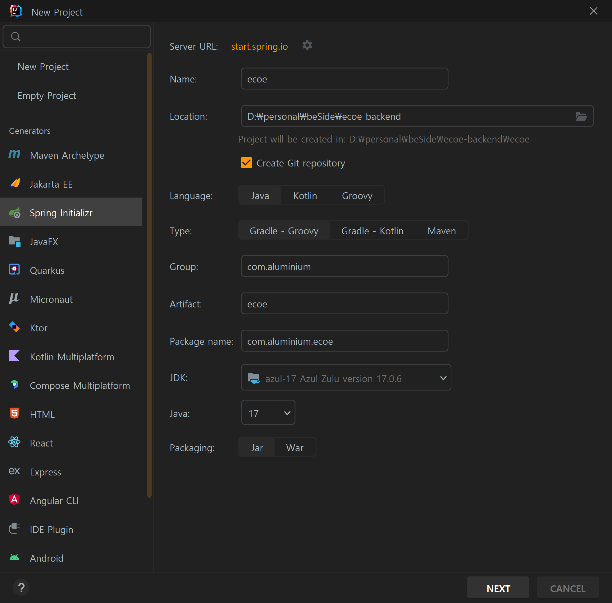
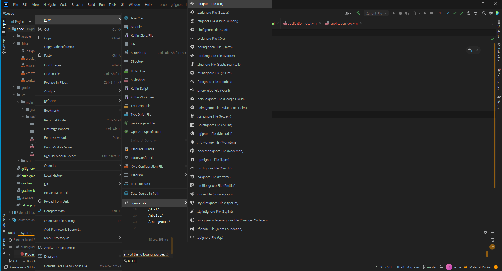
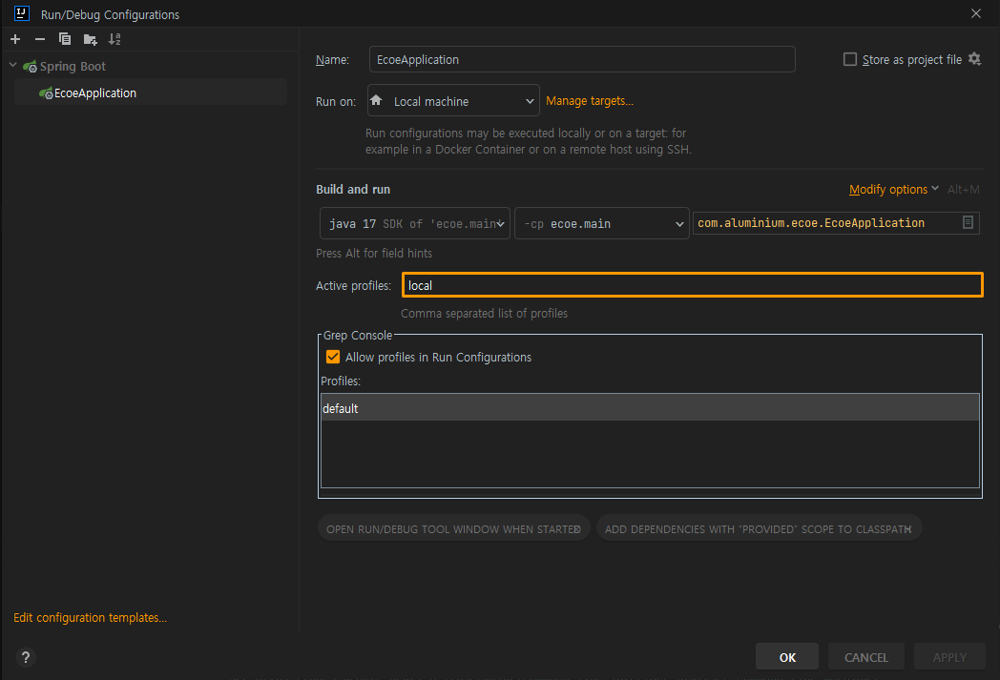

# 🍃 Spring Starter
> :raising_hand: Spring Project Start with intelliJ  
> Ultimate 기준으로 작성

## ✔️ 프로젝트 생성
- intelliJ > new Project > Spring Initializr 선택 및 project metadata 설정  
  
- initial dependencies 세팅  
  

## ✔️ 의존성 추가
- 초기 세팅한 의존성 목록
  - **Spring Web**❓ 스프링 프로젝트가 웹서버로서 작동할 수 있게함(임베디드 톰캣)
  - **Spring Security**❓ 애플리케이션의 보안(인증과 권한, 인가 등)을 담당.
  - **Lombok**❓ getter/setter, constructor와 같은 보일러플레이트 코드 줄여주는 디펜던시.
  - **Spring Configuration Processor**❓ @ConfigurationProperties를 사용하기 위한 의존성으로 applicaiton.yml 파일의 값을 읽어와 멤버변수에 자동 할당. 
  - **Spring Data JPA**❓ 자바 ORM 표준 JPA
  - **queryDsl**
  - **postgreSql**
  - **swagger**❓ API 문서작성
  - **jwt**
  - **test**

- 논의대상 의존성 목록
  - **lucy-xss-servlet**❓ 보안관련. [참고링크](https://shxrecord.tistory.com/212)
  - **org.apache.commons**

- 추후 추가할만한 의존성 목록
  - **Spring DevTools**❓ 개발 편의성 높임. [참고링크](https://velog.io/@bread_dd/Spring-Boot-Devtools)
  - **Spring Cloud**❓ MSA 구성시에 필요. [참고링크](https://velog.io/@ilov-/Cloud-Spring-Cloud)
  - **Spring Redis**❓ 캐쉬 구성.
  - **Spring Boot Actuator**❓ 프로젝트 모니터링. [참고링크](https://incheol-jung.gitbook.io/docs/study/srping-in-action-5th/chap-16.)

## ✔️ build.gradle 구성시 주의
  - gradle7에서 compile은 deprecated 됨, implementation로 대체. 
    - compile 은 연결된 API 가 모두 프로젝트에 의해 노출이되고, implementation 은 노출되지 않음.
    - [참고링크](https://hyeo-noo.tistory.com/396)
  - Gradle 버전에 맞는 각 의존성 버전은 공식문서에서 확인 가능. 
    - [공식문서](https://spring.io/projects/spring-boot#learn)
    - reference docs > dependency version에서 확인!
  - ecoe 프로젝트의 build.gradle 문서에 주석 설명 참고!

## ✔️ GitIgnore 구성
- intelliJ 플러그인 gitIgnore로 구성 > 기본 탬플릿
  

## ✔️ Application.yml
- YAML 파일 환경별로 profile 분리함. [참고링크1](https://escapefromcoding.tistory.com/681), [참고링크2](https://wonyong-jang.github.io/spring/2022/08/11/Spring-Profile.html)
- application.yml, application-local.yml, application-dev.yml
- 

## ✔️ branch 분리
- git flow 전략 사용하여 dev분리

